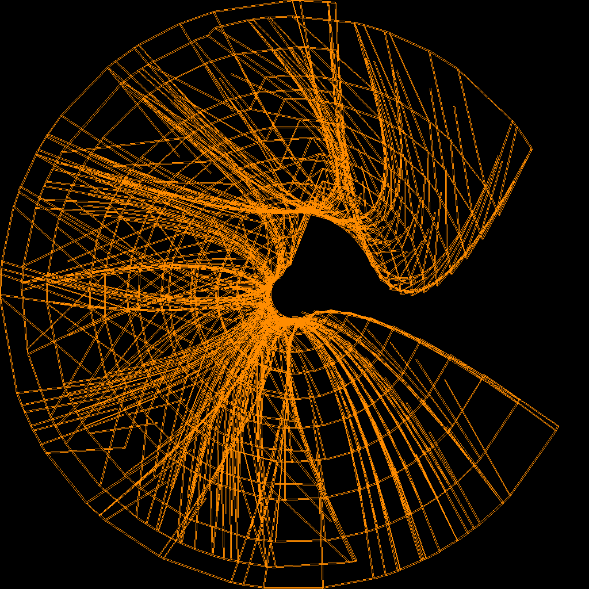
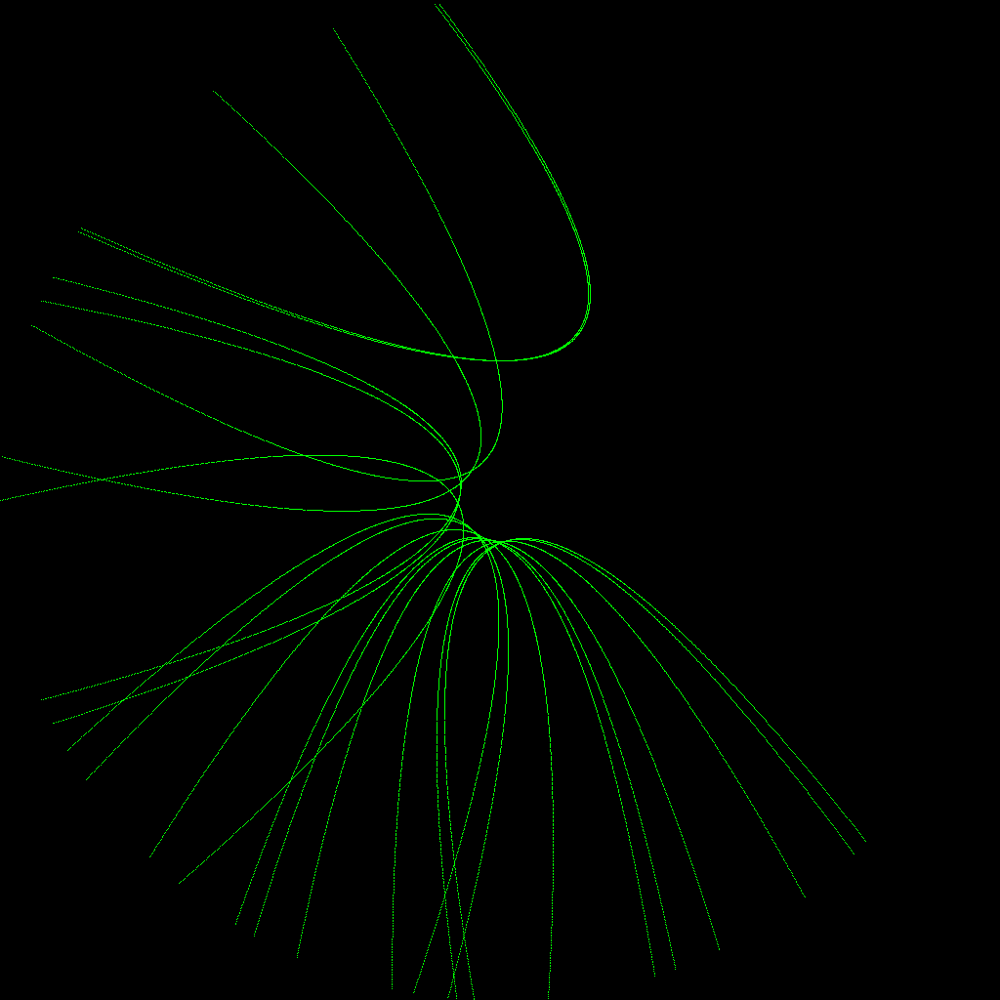
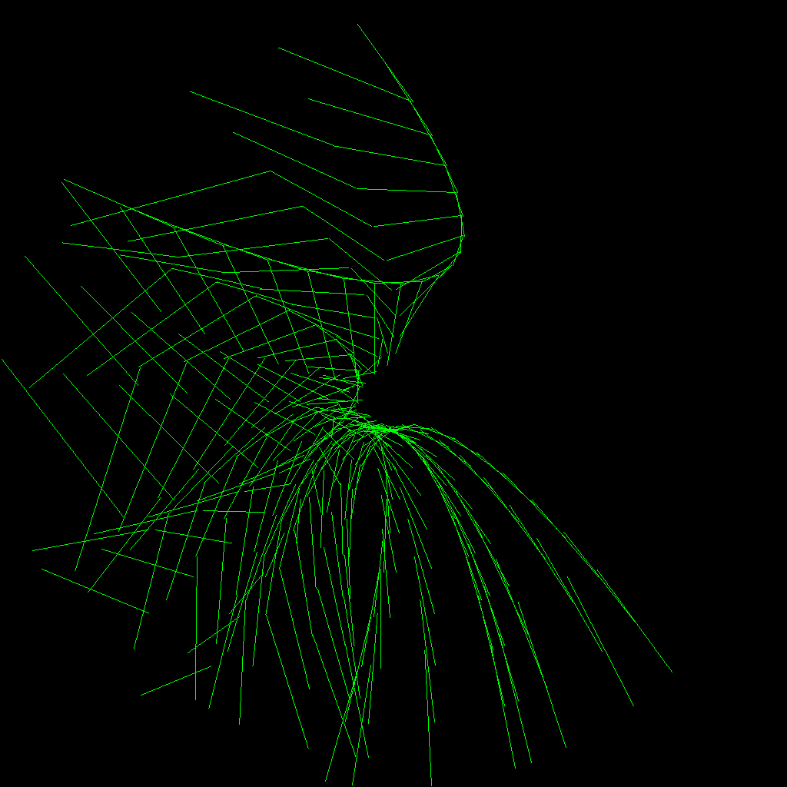
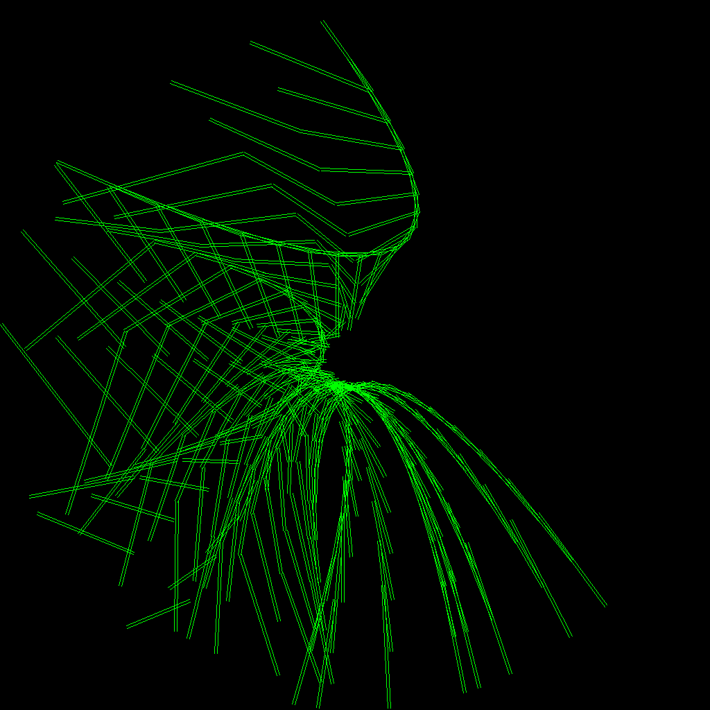

# bc-map

Creates the Bezier City Map.

To make the map data [`city.json`](city.json) and to get a png image of the city run `node render.js` 

The `grabber.js` script was used for making the video
[Optismo](https://www.youtube.com/watch?v=I4Y2nU5avpM) from
the webpage in the `public` dir.

# How the city is made

The `city` is made up of `streets`. Each street has a unique ID.

There are different types of streets:

* `bezier streets` which have the shape of a Bezier Curve
* `diagonal streets` which cut across the `bezier streets`
* `cross streets` which are no longer used

If you just make the `bezier` streets the city looks like this:

These are just used to decide where to put the `diagonal` streets:

A Street has two sides to it. These are called `parallels` and are refered to as the `plus`
and `minus` parallel:

Streets bound `lots`

The [`make_city_lots.js`](make_city_lots.js) script creates the `bezier` and
`diagonal` streets. 

TODO: What does adding junctions do?

