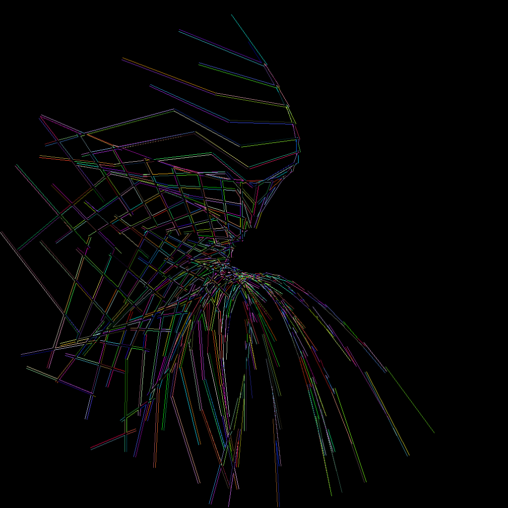
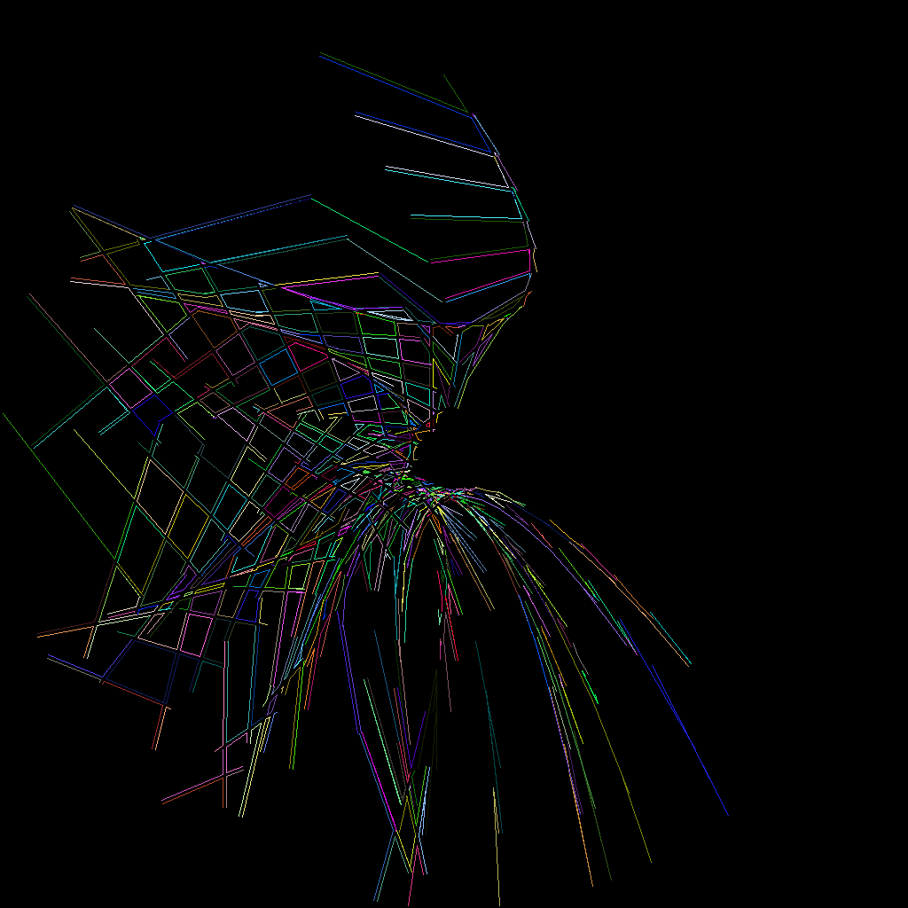

# bc-map


Creates the Bezier City Map.

To make the map data [`city.json`](city.json) and to get a png image of the city run `node render.js` 

The `grabber.js` script was used for making the video
[Optismo](https://www.youtube.com/watch?v=I4Y2nU5avpM) from
the webpage in the `public` dir.

# How the city is made

The `city` is made up of `streets`. Each street has a unique ID.

There are different types of streets:

* `bezier streets` which have the shape of a Bezier Curve
* `diagonal streets` which cut across the `bezier streets`
* `cross streets` which are no longer used

If you just make the `bezier` streets the city looks like this:


These are just used to decide where to put the `diagonal` streets:


A Street has two sides to it. These are called `parallels` and are refered to as the `plus`
and `minus` parallel:


When two streets meet it creates a `junction`. These are the red dots in the image below:


We want to know where the intersection of the two `parallels` of a street occur so we can
stop rendering the parallel street edge when it hits that of another. We then use this 
information to split the existing long streets into shorter streets.

The code here is a bit _bruh_. You have to call three functions in order for it to work.
Needs some TLC:

```
city_builder.add_junctions();
city_builder.intersect_parallels();
city_builder.split_streets();
```

`split_streets` is not very well named as it doesn't actually split the streets.
Rather it creates `lot_edges` which when put together create `lots` which are the
bounded areas of real estate made up from the result of splitting the streets. 
More work required here.



The next step is to bind the `lot_edges` together into discreet `lots`:




# Copyright

(C) Copyright 2023 Peckham Data Centre Ltd. All rights reserved.
