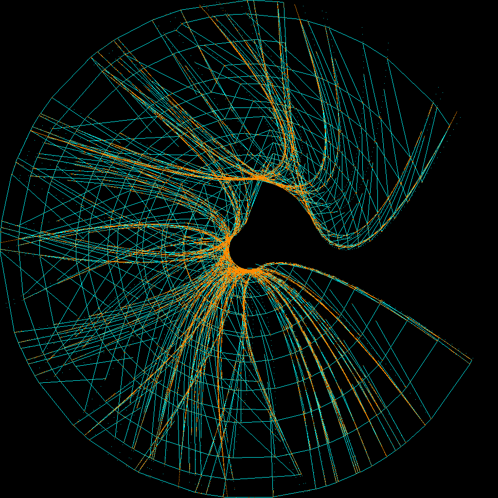

# bc-map

Creates the Bezier City Map.

To make the map data [`city.json`](city.json) and to get a png image of the city run `node render.js` 

The `grabber.js` script was used for making the video
[Optismo](https://www.youtube.com/watch?v=I4Y2nU5avpM) from
the webpage in the `public` dir.
